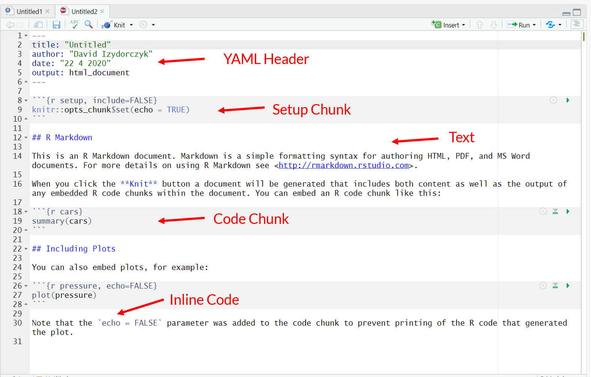
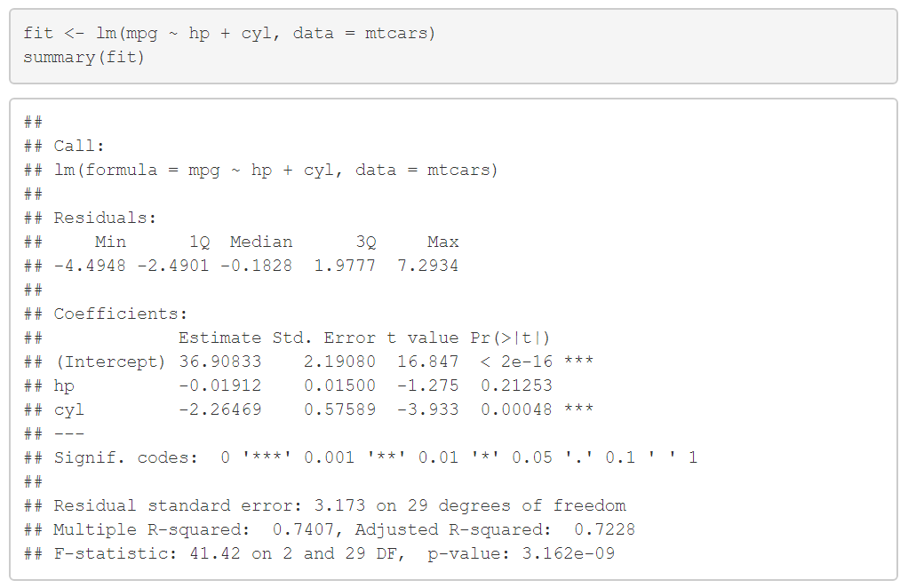
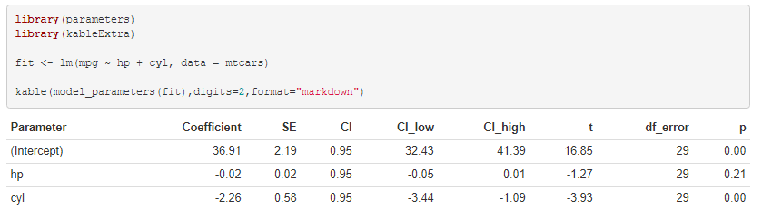

```{r setup, include=FALSE, message = FALSE, warning=FALSE}
options(htmltools.dir.version = FALSE)

library(tidyverse)
library(kableExtra)
library(DT)
library(gganimate)
library(parameters)
library(correlation)
library(plotly)

```


## Workshop

This mini-workshop consists of two parts:

1. Introduction to R Markdown
2. Writing scientific articles with the [papaja](https://github.com/crsh/papaja) package


<!-- *********** NEW SLIDE ************** -->
---
## Learning Goals

At the end of this mini-workshop, you should ... :

- ... know what `RMarkdown` is and how it works

- ... know how to integrate code and data with `RMarkdown`

- ... be able to write APA conform manuscripts with the `papaja`-package


<!-- *********** HEADING ************** -->
---
class: heading,middle


Part 1: Introduction to R Markdown


<!-- *********** NEW SLIDE ************** -->
---
## Why use R Markdown in the first place?

- `R Markdown` makes it easy to combine the power of `R` with the simplicity of Markdown documents

- `R` code and interpretations integrated into a single reproducible document, which can be easily shared
  - with your collaborators/colleagues
  - on OSF
  - or for your later self

- Separate the tasks of *reporting* the results (fun) from *formatting* the results (boring), which
  - decreases risk of copy-paste errors
  - decreases workload
  
- Has many applications:
  - make [presentations](https://bookdown.org/yihui/rmarkdown/presentations.html)
  - write scientific manuscripts with [papaja](https://github.com/crsh/papaja)
  - write books with [bookdown](https://bookdown.org/), e.g. https://bookdown.org/content/3686/
  - create websites with [blogdown](https://bookdown.org/yihui/blogdown/)

<!-- *********** NEW SLIDE ************** -->
---
## How does it work ? 


Source: rstudio.com


- Creating documents with `R Markdown` starts with an .Rmd file that contains a *combination* of **markdown** (content with simple text formatting) and **R code chunks**.

- The .Rmd file is fed to **knitr**, which executes all of the R code chunks and creates a new markdown (.md) document which includes the R code and it’s output.

- The markdown file generated by knitr is then processed by **pandoc** which is responsible for creating a finished  PDF, MS Word document, slide show, etc.


<!-- *********** NEW SLIDE ************** -->
---
## Getting Started - Creating a Markdown document

.center[

]


<!-- *********** NEW SLIDE ************** -->
---
class:content
## Structure

.pull-left3[
An `RMarkdown` document consists of 
- A YAML  header 
- Text
- Code Chunks
  - Setup Chunk
  - Other Chunks
- Inline Code

]
.pull-right3[

]

<!-- *********** HEADING ************** -->
---
class: heading, middle

YAML Header

<!-- *********** NEW SLIDE ************** -->
---
## YAML

```{r, eval = FALSE}
---
title: "My Title"
author: "Max Musterman"
date: "22 04 2020"
output: html_document
---
```

- `YAML` Stands for "YAML Ain't Markup Language"
- This is where you set options for your overall document
- See the Cheat-Sheet or https://rmarkdown.rstudio.com/html_document_format.html

<!-- *********** NEW SLIDE ************** -->
---
## YAML - Output

For example, you can change the [output format](https://rmarkdown.rstudio.com/formats.html) (`html_document`, `pdf_document`, `word_document`, `github_document`, ...)


.pull-left[

```{r, eval = FALSE}
---
title: "My Title"
author: "Max Musterman"
date: "22 04 2020"
output: pdf_document #<<
---
```


]


.pull-right[

```{r, eval = FALSE}
---
title: "My Title"
author: "Max Musterman"
date: "22 04 2020"
output: word_document #<<
---
```


]


<!-- *********** NEW SLIDE ************** -->
---
## YAML - Table of Contents

... add and format the table of contents 


.pull-left[

```{r, eval = FALSE}
---
title: "My Title"
author: "Max Musterman"
date: "22 04 2020"
output:            
    html_document: 
      toc: TRUE      #<<
      toc_depth: 2   #<<
---
```


]


.pull-right[

```{r, eval = FALSE}
---
title: "My Title"
author: "Max Musterman"
date: "22 04 2020"
output:            
    html_document: 
      toc: TRUE      
      toc_depth: 2
      toc_float: true#<<
---
```


]


<!-- *********** NEW SLIDE ************** -->
---
## YAML - Appearance

... change the appearance of [themes](https://www.datadreaming.org/post/r-markdown-theme-gallery/) and [code syntax](https://www.garrickadenbuie.com/blog/pandoc-syntax-highlighting-examples/) 


.pull-left[

```{r, eval = FALSE}
---
title: "My Title"
author: "Max Musterman"
date: "22 04 2020"
output:            
    html_document
---
```


]


.pull-right[

```{r, eval = FALSE}
---
title: "My Title"
author: "Max Musterman"
date: "22 04 2020"
output:            
    html_document: 
      theme: journal       #<<
      highlight: breezedark#<<
---
```


]


<!-- *********** NEW SLIDE ************** -->
---
## YAML - Code Chunks

... make code chunks foldable (`show/hide` as default): 


```{r, eval = FALSE}
---
title: "My Title"
author: "Max Musterman"
date: "22 04 2020"
output:            
    html_document: 
      code_folding: show #<<
---
```


.center[


]

<!-- *********** HEADING ************** -->
---
class: heading, middle

Text Formatting

<!-- *********** NEW SLIDE ************** -->
---
## Sections 

See also the Cheat-Sheet and https://rmarkdown.rstudio.com/authoring_basics.html

.pull-left[
Levels of Headings

```{r eval=FALSE}
# Section 1
bla

## Sub-Section 1.1
bla

### Paragraph 1.1.1
bla

#### Sub-Paragraph 1.1.1.1

```
]

.pull-right[

# Section 1
bla
## Sub-Section 1.1
bla
### Paragraph 1.1.1
bla
#### Sub-Paragraph 1.1.1.1

]

You can use also use the option `number_sections: true` in the YAML header

<!-- *********** NEW SLIDE ************** -->
---
class: small

## Text Formatting 

.pull-left[
Emphasis
```{r eval=FALSE}
__bold__  (or use *) ## **bold**
_italic_ ## *italic* 
~~strikethrough~~
```

***
Lists
```{r eval=FALSE}
- unordered list 
    - sub-item 1 
     
1. ordered list 
2. item 2 
    + sub-item 1 
```

***
Tables

```{r eval=FALSE}
Table Header  | Second Header 
------------- | ------------- 
Table Cell    | Cell 2        
Cell 3        | Cell 4
```

]

.pull-right[

<br>

- __bold__  (or use *)
- _italic_
- ~~strikethrough~~

***
- unordered list 
- item 2 
    - sub-item 1 
    
     
1. ordered list 
2. item 2 
    1. sub-item 1 

***
<br>

Table Header  | Second Header 
------------- | ------------- 
Table Cell    | Cell 2        
Cell 3        | Cell 4

]


<!-- *********** NEW SLIDE ************** -->
---
## Links & Images


.pull-left[
You can also add links

```{r eval=FALSE}
[Click me!](https://google.com/)
```

[Click me!](https://google.com/)
]

.pull-right[

or images (see [here](https://stackoverflow.com/questions/25166624/insert-picture-table-in-r-markdown) for other ways to add images)

```{r eval=FALSE}

```


]


<!-- *********** NEW SLIDE ************** -->
---
## HTML 

If you are knitting to `HTML` (`output: html_document`), you can also directly use `HTML` code

```{r eval=FALSE}
<b> this is bold </b>

<font color ="#FF8C00">Orange text</font>
```

<b> this is bold </b>
<font color ="#FF8C00">Orange text</font>

<!-- *********** NEW SLIDE ************** -->
---
## LaTeX

- You can also use `LaTeX` code for `HTML` & `Word` inside the "math-expression" (and `PDFs` everywhere)
- the math-expression/environment is activated and closed via "$"  

For example:

```{r eval=FALSE}
 $ M_{age} $
```

$M_{age}$

```{r eval=FALSE}
 $ \eta^{2} $
```

$\eta^{2}$


```{r eval=FALSE}
 $ f(k) = {n \choose k} p^{k} (1-p)^{n-k} $ 
```

$f(k) = {n \choose k} p^{k} (1-p)^{n-k}$

use `$$` for display style (same as `"\begin{equation} ... \end{equation}"`)

$$f(k) = {n \choose k} p^{k} (1-p)^{n-k}$$
<!-- *********** NEW SLIDE ************** -->
---
## The Visual Markdown Editor (newish)

Since RStudio Version 1.4 we have a **visual Markdown Editor** (upper-right corner) 


The editor automatically renders Markdown & LaTex input (not the R code, however) and gives a more MS Word like interface, with some helpfull buttons.


.pull-left[

Visual Markdown Editor - off


]

.pull-right[

Visual Markdown Editor - on


]


<!-- *********** NEW SLIDE ************** -->
---
## Now it's your turn !

- Create an RMarkdown document
- Play around with some YAML header options
- Write some text, put in some tables, images etc.


<!-- *********** HEADING ************** -->
---
class: heading, middle

R Code 


<!-- *********** NEW SLIDE ************** -->
---
## Inline R Code

You can use inline `R` code like this: 

```{r  eval=FALSE}
This is the mean `r round(mean(rnorm(100)),2)` 
```

becomes: This is the mean `r round(mean(rnorm(100)),2)`

***

And you can combine it with `LaTeX` math expressions

```{r  eval=FALSE}
This is the mean $ M_{age} = `r rnorm(100,22,10) %>% mean() %>%  round(.,2)`$
```

becomes: This is the mean $M_{age} = `r  rnorm(100,22,10) %>% mean() %>%  round()`$


<!-- *********** NEW SLIDE ************** -->
---
## Example in action: 


```{r}
demo <- data.frame(age    = rnorm(100,25,5),
                   gender = sample(x    = c("male","female"),
                                   size = 100,
                                   prob = c(0.3,0.7),replace=T))

```

```{r eval = FALSE}

Our final sample consisted of $ n $ = `r nrow(demo)` 
participants (`r mean(demo$gender=="female")*100` % female,
$ M_{age} = `r demo[,"age"] %>% mean() %>% round()`$)
```

Our final sample consisted of $n$ = `r nrow(demo)` participants (`r mean(demo$gender=="female")*100` % female, $M_{age} = `r demo[,"age"] %>% mean() %>% round(2)`$)


<!-- *********** NEW SLIDE ************** -->
---
## Now it's your turn !

- Try to write some inline R code (you can use the R-intern data.frames like `sleep`, `mtcars`, or `chickwts`)
- Combine it with `LaTeX` math-expressions ($)


<!-- *********** NEW SLIDE ************** -->
---
## Code chunks
.pull-left2[
- You can create code chunks with the shortcut <kbd>Strg</kbd>+<kbd>Alt</kbd>+<kbd>I</kbd>.

- Run a code chunk with <kbd>Ctrl</kbd> + <kbd>Shift</kbd> + <kbd>Enter</kbd>

````
`r ''````{r}
4 + 2
rnorm(2)
```


```{r }
4 + 2
rnorm(2)
```
]


.pull-right2[
Some important chunk options (see also [here](https://yihui.org/knitr/options/#chunk-options)):

-  names -> will show up in the outline and can be used for references
- `echo`: Display code in output document (default = `TRUE`)
- `include`: Include chunk and output in doc after running (default = `TRUE`)
- `fig.height` and `fig.width`: Dimensions of plots in inches
- `error`: Display error messages in doc (`TRUE`) or stop render when errors occur (`FALSE`) (default = `FALSE`)
- `warning`: display code warnings in document (default = `TRUE`)
- `results`: How to format results:
  - default = `'markup'`
  - `'asis'` - pass through results
  - `'hide'` - do not display results
- `cache`: cache results for future knits (default = `FALSE`)
]


<!-- *********** NEW SLIDE ************** -->
---
## Examples


- `echo = TRUE`

```{r echo = TRUE}
4 + 2
```

***

- `echo = FALSE`

```{r echo = FALSE}
4 + 2
```

***

- `include = FALSE`

```{r include = FALSE}
4 + 2
```

***

- `include = TRUE, eval = FALSE`

```{r include = TRUE, eval = FALSE}
4 + 2
```


<!-- *********** NEW SLIDE ************** -->
---
## Reading in Data &  Paths when knitting

Sometimes the paths can be tricky when using Markdown documents, for instance when reading in your data. When knitting, `R` defaults to using the directory of the `.Rmd` document as the working directory. 

So if you have the following project structure:

```{r, eval = FALSE}

CoolProject
  - Data
    |-- raw.csv
  - Scripts
    |-- analyis.R
    |-- report.Rmd
  - Manuscript
    |-- V2_001_finish.docx
  CoolProject.Rproj

```

And your normal working directory is just `CoolProject`, you would use `read.csv("Data\raw.csv")` to read in the data for your `analysis.R`script.

For your `report.Rmd`, however, you have to use `read.csv("..\Data\raw.csv")`, this is the relative path from your  `.Rmd` document.

<!-- *********** NEW SLIDE ************** -->
---
## Example reading in the `sleep.csv`


When you are writing your RMarkdown and working on your analysis, you would use code like this:

```{r eval = FALSE}
sleep <- read.csv2("Data/sleep.csv")
```

However, when you knit this you will get an error `Fehler in file(file, "rt") : kann Verbindung nicht öffnen ...` . Instead you should use:

```{r eval = FALSE}
sleep <- read.csv2("../Data/sleep.csv")
```

Read `../` as "go up one folder in the folder-structure". 


<!-- *********** HEADING ************** -->
---
class: heading, middle

Taking Advantage of R


<!-- *********** NEW SLIDE ************** -->
---
## Make nicer tables  with kableExtra and DT 

Normal Output: 

```{r}
head(iris,10)
```

<!-- *********** NEW SLIDE ************** -->
---
## Make nicer tables  with kableExtra and DT 

With `kable()`: 

```{r message=FALSE}
library(kableExtra)

kable(head(iris,10),format="markdown")  # or format = latex if output: pdf_document
```


<!-- *********** NEW SLIDE ************** -->
---
## Make nicer tables  with kableExtra and DT 

With  `datatable()` from the [DT package](/https://rstudio.github.io/DT/) : 

```{r message=FALSE, warning=FALSE}
library(DT)
DT::datatable(head(iris,10),
          filter  = list(position = 'top'),
          options = list(
            lengthMenu = list(c(2, 3 , -1), c('2', '3',  'All')), pageLength = 3
          ))
              
```


<!-- *********** NEW SLIDE ************** -->
---
## Make nicer tables  with kableExtra and DT 

Also check out the YAML option `df_print: paged`


.pull-left[

```{r, eval = FALSE}
---
title: "Untitled"
author: "David Izydorczyk"
date: "22 4 2020"
output: 
  html_document
---
```


]


.pull-right[

```{r, eval = FALSE}
---
title: "Untitled"
author: "David Izydorczyk"
date: "22 4 2020"
output: 
  html_document:
    df_print: paged#<<
---
```


]


<!-- *********** NEW SLIDE ************** -->
---
## Now it's your turn !

- Add a code chunk reading in the `sleep.csv` data from the `Data` folder
- Print the data using either `kable`, `data.table`, or `df_print: paged`


<!-- *********** NEW SLIDE ************** -->
---
## Nicer output  with [parameters](https://easystats.github.io/parameters/)

From the documentation: [parameters](https://easystats.github.io/parameters/) primary goal is to provide utilities for processing the parameters of various statistical models (see here for a list of supported models)

Works with results from `lm, lmer4, SEM, etc`


.pull-left[
Normal `lm()` output: 



]
.pull-right[
With `model_parameters()` from `parameters` :



]

<!-- *********** NEW SLIDE ************** -->
---
## Better correlation output with [correlation](https://easystats.github.io/correlation/)

```{r}
results <- correlation(trees)
results 

```

```{r}
results <- correlation(trees)
summary(results)
```


<!-- *********** NEW SLIDE ************** -->
---
## Plots and their chunk options

Every plot you make in R will just appear in your knitted RMarkdown document


```{r fig.height=3, fig.width= 4, dev='svg'}

sleep %>% 
  ggplot(aes(x=group,y=extra)) +
    geom_boxplot() +
    geom_jitter(aes(fill = group),size = 2, shape = 21, height = 0, width = 0.2) +
    theme_bw() +
    labs(y = "increase in hours of sleep")

```

<!-- *********** NEW SLIDE ************** -->
---
## Plots and their chunk options

Using the chunk options, you can ... :

- change the height and width of the figure using `fig.height=3, fig.width= 4`

- change the alignment of the figure with `fig.align='center'`

- add a caption with  `fig.cap = "This is a caption" `

- increase the resolution with `dpi = 900`


<!-- *********** NEW SLIDE ************** -->
---
## Make nicer plots with [plotly](https://plotly-r.com/index.html)   

.pull-left[
Normal `ggplot2` output: 

```{r fig.height=3, fig.width= 4, dev='svg'}
library(ggplot2)

ggplot(chickwts,aes(x=feed,y=weight)) +
  geom_boxplot() +
  theme_bw()

```

]
.pull-right[
With plotly

```{r  message=FALSE,fig.height=4.5, fig.width= 7, dev='svg'}
library(plotly)

p <- ggplot(chickwts,aes(x=feed,y=weight)) +
        geom_boxplot() +
        theme_bw()
ggplotly(p) #<<
```

]

<!-- *********** NEW SLIDE ************** -->
---
## Now it's your turn !

- Make some nice plots in R 
- Play around with the chunk options
- Maybe try changing the `output: ... ` part in the YAML header to test out different output formats 


<!-- *********** NEW SLIDE ************** -->
---
class: small
## Interactive Plots with runtime: shiny 

You can also use shiny elements in your HTML - Markdown document or presentation

```{r, eval = FALSE}
---
title: "Untitled"
author: "David Izydorczyk"
date: "22 4 2020"
output: html_document
runtime: shiny #<<
---

# start code chunk 

library(dplyr)
library(ggplot2)
  
inputPanel(
  numericInput("Mean"  , label = "Mean" ,value = 0)
)

# This functionblock gets executed everytime one of the input changes

renderPlot({

m   <- input$Mean
  
rnorm(100,m,5) %>% as.data.frame %>% 
 ggplot(aes(x=.)) +
  geom_histogram(aes(y=..density..)) +
  geom_density(aes(y=..density..),fill="tomato1",alpha=0.4) +
  theme_bw()
})
# end code chunk

```


<!-- *********** NEW SLIDE ************** -->
---
## Helpful references:

- https://bookdown.org/yihui/rmarkdown


